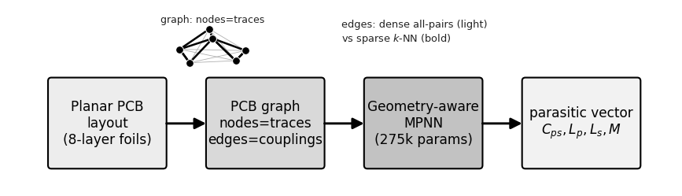

# A License-Clean Graph Neural Network for Fast Parasitic Extraction in PCB-Embedded Planar Magnetics

A pure-PyTorch, geometry-aware message-passing model for four lumped parasitics of
an 8-layer planar-LLC PCB winding: inter-winding capacitance `C_ps`, self-inductances
`L_p` / `L_s`, and primary-secondary mutual inductance `M`. In the audited
batch-one protocol, raw-layout-to-prediction inference takes **5.62 ms**, versus a
**3.659 s** median for the evaluated 3-D reference-solver workflow. The median of
the paired per-design ratios is **670×**. The earlier 1.17 ms number is a legacy pre-collated
throughput measurement, not end-to-end latency.

The implementation uses PyTorch without PyG or DGL. Source code is BSD-3-Clause;
external reference solvers are not redistributed.

**Research status:** The released results are
solver-validated, not measurements from a fabricated board.

## Manuscript packages

The repository keeps manuscript packages separate from experiment evidence:

| Package | Purpose | Contents |
|---|---|---|
| [`Paper_Summary/`](Paper_Summary/) | Archival conference-format snapshot | `main.tex`, `GNN_Parasitic.pdf`, and a compatibility build wrapper |
| [`Paper_Full/`](Paper_Full/) | Current authoritative manuscript | LaTeX, bibliography, publication figures, build script, version metadata, and final PDF |

`Paper_Full/` is authoritative for the current claims, protocols, and reported
numbers. `Paper_Summary/` is retained as an archival snapshot; its timing and
equivariance wording is superseded by the extended manuscript.

Build either package from the repository root:

```bash
bash Paper_Summary/build.sh
bash Paper_Full/build.sh
```

The extended build regenerates its figures from
[`results/proof_updates/results.json`](results/proof_updates/results.json).



> **Notation.** `M` is the *winding* mutual inductance—a free-space, geometry-driven
> coupling term. It is **not** the magnetizing inductance, which is set by the core
> permeability and is a separate, roughly 37–73× larger quantity (quantified in
> `results/run_coremfem/`). Earlier drafts of this work wrote `L_m`; that notation was
> ambiguous and has been retired.

## Results at a glance

| Claim | Number | Where it comes from |
|---|---|---|
| `C_ps` vs 3-D electrostatic FEM | **2.63 %** median, R² = 0.962 | [`results/proof_updates/`](results/proof_updates/) |
| `L_p` / `L_s` / `M` vs FastHenry 3-D | **2.45 / 3.31 / 1.75 %** median | [`results/proof_updates/`](results/proof_updates/) |
| Paired solver-to-end-to-end speed | **670×** median paired ratio; component medians are 3.659 s and 5.62 ms | [`results/proof_updates/`](results/proof_updates/) |
| Historical batched-throughput estimate | **~4,300×** (rounded 5 s / 1.17 ms) | [`results/proof_updates/`](results/proof_updates/) |
| Family-disjoint ranking | Spearman **ρ = 0.93** | [`results/run_rank/`](results/run_rank/) |
| Lateral-registration ranking | **ρ = 0.95** (analytical model is blind) | [`results/run_ranklat2/`](results/run_ranklat2/), [`results/run_declat/`](results/run_declat/) |
| Cross-solver check (independent Neumann) | GNN inside the FastHenry↔Neumann gap | [`results/run_xsolver/`](results/run_xsolver/) |
| Frequency-resolved `R_ac/R_dc(f)` | **0.37 %** median | [`results/run_t3/`](results/run_t3/) |

The metrics are reported per target. In particular, `C_ps` has R² = 0.962; this
repository does not summarize the four targets as a single "R² >= 0.98" claim.

### Why a graph, and not gradient-boosted trees

On an identical 332/67 solver-labeled split (`results/run_trees/`):

| Model | `C_ps` R² (med %) | `L_p` | `L_s` | `M` | rank ρ | size-gen R²(`M`) |
|---|---|---|---|---|---|---|
| RandomForest | 0.462 (12.9) | 0.887 | 0.914 | 0.880 |   | 0.112 |
| XGBoost | 0.927 (3.8) | 0.878 | 0.908 | 0.914 |  | 0.231 |
| LightGBM | 0.942 (**2.9**) | 0.893 | 0.890 | 0.918 | 0.088 | 0.247 |
| CatBoost | 0.892 (4.7) | 0.896 | 0.893 | 0.920 | — | 0.324 |
| **GNN** | **0.962** (2.63) | **0.994** | **0.995** | **0.995** | **0.93** | **0.943** |

Trees are level with the GNN on the scalar capacitance, and the two metrics remain
close there: the GNN reaches R² = 0.962 and 2.63 % median relative error, versus
LightGBM at 0.942 and 2.9 %. R² is a squared-error measure dominated by the
largest-`C_ps` layouts, whereas the median is scale-free and outlier-robust.
The graph earns its place on everything **relational**: the inductances, the
within-family ordering, and transfer to board sizes never trained on.

### Negative results and corrected findings

- A controlled **strict encoded-graph `E(3)`** ablation does not resolve an accuracy
  advantage: strict error is 6.27% higher in the parameter-matched comparison,
  with a 95% interval of [-4.44%, +17.68%]. A same-width sensitivity arm is also
  inconclusive (+6.98%, 95% interval [-1.08%, +14.98%]). These results support neither categorical
  superiority nor practical equivalence. The strict claim applies after graph
  construction; the axis-aligned layout-to-graph builder is outside that boundary.
- The **dense** all-pairs graph is **slower** than the analytical baseline at the
  benchmark scale; only the sparse k-NN variant overtakes it, at N ≈ 80
  (`results/scaling_v1/`).
- **FastCap** did not converge on ~0.1 mm inter-layer gaps (R² = −0.388); we switched
  to a volume FEM for `C_ps` and say so rather than hiding the failed path
  (`results/run_allfield/`).
- A pointwise regressor ranks at only **ρ = 0.27**; the ρ = 0.93 requires a dedicated
  pairwise objective. The earlier ρ = 0.51–0.74 was a leakage artifact.

**All accuracy here is solver-grade, not hardware-anchored.** No measured board has
been compared against. That campaign is the stated next step.

## Layout

```
code/          source, grouped by role see code/README.md for the file index
├── core/            graph representation, analytical PEEC labels, train/eval driver
├── models/gnn/      the proposed MPNN + the E(n)-equivariant variant
├── solvers/         3-D ground truth: FastHenry, FastCap/FasterCap, scikit-fem
├── data/            seeded corpus generators
├── experiments/     one directory per claim:
│   ├── labels/          the label-quality thread (the paper's core story)
│   ├── baselines/       gradient-boosted trees "why a graph?"
│   ├── architecture/    equivariance (negative result)
│   ├── ranking/         ranking head + layout-decision regret
│   ├── frequency/       R_ac/R_dc(f)
│   ├── scaling/         wall-time scaling
│   ├── anchors/         real commercial core, cross-solver check
│   ├── proofs/          strict-E(3), paired latency, and legacy timing protocols
│   └── rounds/          multi-seed validation and ablation bundles
├── figures/         legacy and extended-paper figure generators
├── quality/         manifest and release-integrity checks
├── jobs/            portable SLURM submit scripts plus shared environment helper
└── env.sh           puts every sub-directory on PYTHONPATH
results/       run outputs plus the proof-update aggregate used by paper figures
figures/       paper figures (PDF + PNG)
Paper_Full/    extended manuscript package only
Paper_Summary/ historical summary manuscript package only
datasets/      per-corpus meta.json + labels.json (see "Data" below)
logs/          available SLURM stderr and selected stdout records
MANIFEST.json  deterministic SHA-256 inventory of the current tracked tree
```

Module files are grouped by directory but their imports stay flat
(`from gnn_baseline import ...`). Several `experiments_*` files are de-facto
libraries  `experiments_v5` is imported by 15 other modules  so splitting them
into packages would have meant rewriting the whole import web. Instead every
sub-directory is placed on `PYTHONPATH`:

```bash
source code/env.sh
```

The SLURM scripts in `code/jobs/` do this themselves.

## Install

```bash
python3 -m venv .venv && . .venv/bin/activate
pip install -r requirements.txt
```

Core requirements are PyTorch + NumPy/SciPy. The 3-D reference solvers additionally
need `scikit-fem`, `gmsh`, and `meshio`; the tree baselines need
`xgboost` / `lightgbm` / `catboost`. See `THIRD_PARTY_NOTICES.md` for the
dependency boundary.

### External reference solvers

`FastHenry` and `FastCap` are **not** redistributed here. Both are MIT-licensed and
build from source in a couple of minutes:

```bash
git clone https://github.com/ediloren/FastHenry2  && make -C FastHenry2
git clone https://github.com/ediloren/FastCap2    && make -C FastCap2
```

Set the binary paths explicitly, or place the executables under
`code/solvers/tools/`:

```bash
export FASTHENRY_BIN=/absolute/path/to/fasthenry
export FASTCAP_BIN=/absolute/path/to/fastcap
export FASTERCAP_BIN=/absolute/path/to/fastercap  # optional
```

## Data

The generated corpora are **not** in this repository: `synth_v1` and `synth_v2`
together are ~430 MB of `layouts.jsonl`. What ships is each corpus's `meta.json` and
`labels.json`, plus the generator and its fixed seed, so the geometry regenerates
bit-for-bit:

```bash
source code/env.sh
python3 code/data/generate_synth.py --n 250  --seed 42 --out datasets/synth_v0
python3 code/data/generate_synth.py --n 2000 --seed 42 --out datasets/synth_v1
# Heavy: submit code/jobs/submit_corpus_v2.sh instead of running on a login node.
python3 code/data/gen_corpus_fh.py --n 1500 --seed 42 --max_per_net 36 \
  --out datasets/synth_v2
```

For claim reproduction, verify the regenerated `synth_v2/layouts.jsonl` SHA-256
is `d0751f18c8e80a8801c2142b95b0ff126b14e452bb2190ea806c88d1c9297ddc`.
The released `meta.json` records 1500 samples, mean 39.1 and maximum 70 trace
nodes, with `label_Lm = filament_fasthenry_5x2`.

```bash
python3 code/quality/verify_corpora.py --data-root datasets --require-layouts
```

For a clean SLURM regeneration, export an unused staging destination before
submission; the job refuses to overwrite an existing corpus:

```bash
export PCB_GNN_CORPUS_OUT=/scratch/$USER/pcb-gnn/synth_v2
sbatch -A <your-account> code/jobs/submit_corpus_v2.sh
```

## Reproducing a result

Legacy claims trace to their run directories. The strict-E(3), paired-latency,
and legacy-timing protocols live in `code/experiments/proofs/`; their SLURM jobs
write job-scoped raw records under `results/proof_updates/jobs/`. The deterministic
aggregate in `results/proof_updates/results.json` is built only from those records.

```bash
source code/env.sh

python3 code/experiments/labels/experiments_femcps.py
python3 code/experiments/labels/experiments_fhlabels.py
python3 code/experiments/anchors/experiments_xsolver.py
python3 code/experiments/baselines/experiments_trees.py --use-field-labels \
  --out results/run_trees
python3 code/experiments/ranking/experiments_rank.py
python3 code/experiments/architecture/experiments_t2.py
python3 code/experiments/scaling/scaling_experiment.py \
  --out results/scaling_v1 --ckpt results/run_v1/gnn_checkpoint.pt
```

From the repository root, regenerate either figure set with:

```bash
python3 code/figures/make_figures.py                 # legacy release figures
python3 code/figures/make_paper_full_figures.py      # Paper_Full figures
```

**These are not laptop jobs.** The solver-reference runs call a 3-D FEM and FastHenry per
layout; building the 332-sample `run_trees` corpus alone takes ~20 min on 8 cores. The
matching `submit_*.sh` SLURM scripts are shipped in `code/jobs/`. They carry no account
code  pass your own:

```bash
sbatch -A <your-account> code/jobs/submit_trees.sh
```

Submit from the repository root. `slurm_job_env.sh` resolves the checkout from its
own path, while `PCB_GNN_DATA_ROOT`, `PCB_GNN_PYTHON`, and solver variables make
external corpora, environments, and binaries explicit.

The claim-proof environment is pinned in `requirements-proof.txt`. Reproduction
means identical versioned source, verified input and executable hashes, fixed
splits/seeds, raw records, and declared numerical tolerances. Exact wall time and
last-bit floating-point equality are not portable across CPU models; each proof
record therefore captures the node, dependency versions, and timing distribution.

### Provenance

Every updated manuscript number resolves to one completed compute job and its raw
artifacts:

| Protocol | Job record | Raw supporting records | Frozen source and submit wrapper |
|---|---|---|---|
| Paired solvers, four-target accuracy, and end-to-end latency | [`job_51174495/results_claim_proof.json`](results/proof_updates/jobs/claim_proof/job_51174495/results_claim_proof.json) | [`raw_solver_timings.jsonl`](results/proof_updates/jobs/claim_proof/job_51174495/raw_solver_timings.jsonl) | [`experiments_claim_proof.py`](code/experiments/proofs/experiments_claim_proof.py), [`submit_claim_proof.sh`](code/jobs/submit_claim_proof.sh) |
| Strict encoded-graph `E(3)` and five-seed ablation | [`job_51174496/results_strict_egnn_ablation.json`](results/proof_updates/jobs/strict_e3/job_51174496/results_strict_egnn_ablation.json) | [`field_grade_targets.jsonl`](results/proof_updates/jobs/strict_e3/job_51174496/field_grade_targets.jsonl); per-seed predictions and bootstrap draws are embedded in the result | [`experiments_strict_egnn_ablation.py`](code/experiments/proofs/experiments_strict_egnn_ablation.py), [`submit_strict_egnn_ablation.sh`](code/jobs/submit_strict_egnn_ablation.sh) |
| Historical pre-collated latency protocol | [`job_51174497/results_legacy_latency_reproduction.json`](results/proof_updates/jobs/legacy_latency/job_51174497/results_legacy_latency_reproduction.json) | repetition-level timings are embedded in the result | [`experiments_reproduce_legacy_latency.py`](code/experiments/proofs/experiments_reproduce_legacy_latency.py), [`submit_reproduce_legacy_latency.sh`](code/jobs/submit_reproduce_legacy_latency.sh) |

The job records capture the clean source commit, code/data/binary hashes, arguments,
dependency versions, split, per-design values, timing protocol, and compute
environment. Selected stdout/stderr transcripts are retained in [`logs/`](logs/).
The manuscript aggregate is regenerated and verified from the three final records:

```bash
python3 code/quality/build_proof_updates.py \
  --claim results/proof_updates/jobs/claim_proof/job_51174495/results_claim_proof.json \
  --strict results/proof_updates/jobs/strict_e3/job_51174496/results_strict_egnn_ablation.json \
  --legacy results/proof_updates/jobs/legacy_latency/job_51174497/results_legacy_latency_reproduction.json \
  --output results/proof_updates/results.json
```

`MANIFEST.json` carries a SHA-256 for every tracked file except itself and can be
verified with:

```bash
python3 code/quality/build_manifest.py --check
```

## Known limitations

1. **Solver-validated, not hardware-validated.** Agreement with a 3-D field solver
   does not establish agreement with a measured board.
2. **Air-core references.** FastHenry and the electrostatic FEM carry no magnetic
   material; the targets are winding-geometry parasitics. The core magnetizing term is
   validated separately against a real EER40 GP95 datasheet `A_L` (~5 % at production
   gaps, `results/run_pfc/`) and is 37–73× larger than `M` (`results/run_coremfem/`).
3. **Synthetic geometry.** Random interleaved rectangular foils; no vias, return
   planes, or board-level parasitics.
4. **`C_ps` dielectric.** The FEM uses a uniform effective permittivity, not a layered
   stack-up.
5. **Extrapolation beyond N ≈ 70.** Accuracy is *measured* to 70 trace nodes; the
   scaling study's N = 1280 point extrapolates accuracy, and says so.

## License

Project source is BSD-3-Clause; see `LICENSE`. Optional external solvers and
Python packages keep their upstream terms and are documented in
`THIRD_PARTY_NOTICES.md`.
